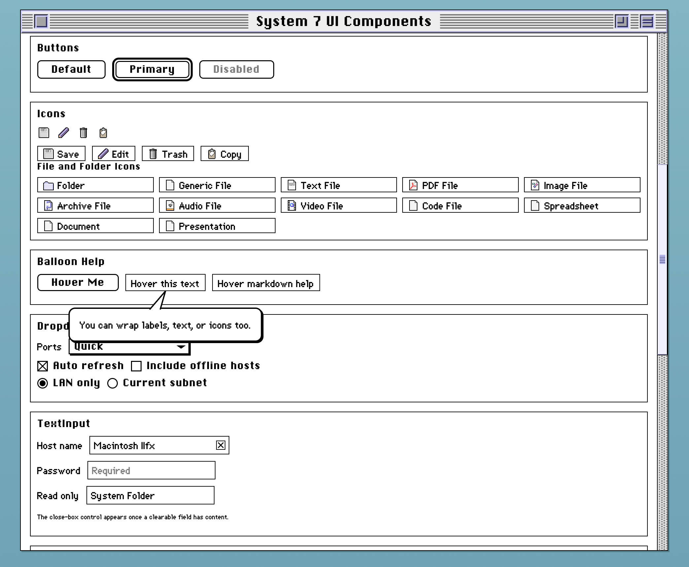

# @lkmc/system7-ui

Reusable System 7 visual components for Svelte/Tauri apps.



## Install

```bash
npm install @lkmc/system7-ui
```

For local development before publishing:

```json
{
  "dependencies": {
    "@lkmc/system7-ui": "file:../../system7-ui"
  }
}
```

## Usage

Import the shared stylesheet once in your root layout:

```ts
import '@lkmc/system7-ui/styles.css';
```

Wrap the section that uses these components with `.s7-root` to apply System 7 typography and scrollbar styling without leaking into the entire host app:

```svelte
<div class="s7-root">
  <!-- system7-ui components -->
</div>
```

### Color Tokens

`system7-ui` exposes CSS variables for theming. Core color tokens:

- `--system7-color-accent`
- `--system7-color-accent-text`
- `--system7-color-highlight`
- `--system7-color-highlight-text`
- `--system7-color-ink`
- `--system7-color-paper`

Default accent/highlight tokens automatically fall back to legacy names used in host apps:

- `--system-accent-color`
- `--system-accent-text-color`
- `--system-highlight-color`
- `--system-highlight-text-color`

### macOS/Tauri System Colors

If your app already retrieves OS colors (for example, through a Tauri command), you can apply them directly with exported helpers:

```ts
import { applySystem7SystemColors } from '@lkmc/system7-ui';

const colors = await TauriService.getSystemColors();
applySystem7SystemColors(colors);
```

Or generate an inline style string for a specific container:

```ts
import { getSystem7ColorStyle } from '@lkmc/system7-ui';

const style = getSystem7ColorStyle(colors);
```

Import components from the package root:

```svelte
<script lang="ts">
  import { Button, TitleBar } from '@lkmc/system7-ui';
</script>
```

## Exports

- `BalloonHelp`
- `ArchiveFileIcon`
- `AudioFileIcon`
- `Button`
- `Checkbox`
- `CloseIcon`
- `CodeFileIcon`
- `ConfirmDialog`
- `CopyIcon`
- `DataTable`
- `DocumentFileIcon`
- `DownloadIcon`
- `Dropdown`
- `EditIcon`
- `ErrorBoundary`
- `ErrorBanner`
- `ExpandableSection`
- `FolderIcon`
- `GenericFileIcon`
- `ImageFileIcon`
- `ModalDialog`
- `MovableDialog`
- `Notification`
- `PdfFileIcon`
- `PresentationFileIcon`
- `ProgressBar`
- `Radio`
- `SpreadsheetFileIcon`
- `TextFileIcon`
- `TitleBar`
- `TrashIcon`
- `VideoFileIcon`

### Utility Exports

- `applySystem7SystemColors`
- `getSystem7ColorStyle`
- `getSystem7ColorVariables`

### Type Exports

Each component now includes an explicit `*Props` type export from the package entrypoint.

```ts
import type {
  ButtonProps,
  CheckboxProps,
  ModalDialogProps,
  MovableDialogProps,
  PdfFileIconProps,
  System7SystemColors
} from '@lkmc/system7-ui';
```

### File Icons

Use the file icon components for file pickers, upload queues, and table rows:

- `FolderIcon`
- `GenericFileIcon`
- `TextFileIcon`
- `PdfFileIcon`
- `ImageFileIcon`
- `ArchiveFileIcon`
- `AudioFileIcon`
- `VideoFileIcon`
- `CodeFileIcon`
- `SpreadsheetFileIcon`
- `DocumentFileIcon`
- `PresentationFileIcon`

```svelte
<script lang="ts">
  import { FolderIcon, PdfFileIcon, TextFileIcon } from '@lkmc/system7-ui';
</script>

<FolderIcon alt="Books" />
<PdfFileIcon />
<TextFileIcon />
```

## BalloonHelp

`BalloonHelp` wraps any element and shows hover help text.

```svelte
<script lang="ts">
  import { BalloonHelp, Button } from '@lkmc/system7-ui';

  const helpMessage = [
    '**Scan profile tips**',
    '',
    '- Quick: common ports',
    '- Deep: larger scan range',
    '- Use `Auto refresh` for live updates'
  ].join('\n');
</script>

<BalloonHelp markdown message={helpMessage} position="bottom" delay={600}>
  <Button>Hover for help</Button>
</BalloonHelp>
```

Props:

- `message` (`string`): Balloon text content.
- `position` (`'top' | 'bottom'`, default `bottom`): Preferred side of the anchor element.
- `delay` (`number`, default `1000`): Hover delay in milliseconds before showing.
- `markdown` (`boolean`, default `false`): Renders `message` as Markdown (raw HTML input is disabled).

Behavior notes:

- Automatically repositions to stay within the viewport bounds.
- Constrains width/height and wraps long text to avoid screen overflow.

## Button

`Button` supports three variants and a default slot for label/icon content.

Props:

- `variant` (`'default' | 'primary' | 'icon'`, default `default`)
- `disabled` (`boolean`, default `false`)
- `type` (`'button' | 'submit' | 'reset'`, default `button`)
- `title` (`string`, default `''`)
- `onclick` (`(e: MouseEvent) => void`)

Slots:

- `default`: button content (text or icon)

## Checkbox

`Checkbox` supports either a `label` prop fallback or slotted label content.

Props:

- `checked` (`boolean`, default `false`)
- `disabled` (`boolean`, default `false`)
- `id` (`string`, default `''`)
- `name` (`string`, default `''`)
- `value` (`string`, default `'on'`)
- `label` (`string`, default `''`)
- `onchange` (`(checked: boolean, e: Event) => void`)

Slots:

- `default`: label content shown to the right of the checkbox icon

## DataTable

`DataTable` provides a reusable split-header table shell with sortable headers, dual header/body separators, empty/loading states, and a row slot.

Common props:

- `columns` (`Array<{ key, label, width?, className?, align?, sortable?, ariaLabel? }>`)
- `sortKey` (`string | null`)
- `sortDirection` (`'asc' | 'desc'`)
- `onSort` (`(key: string) => void`)
- `loading` (`boolean`)
- `loadingText` (`string`)
- `empty` (`boolean`)
- `emptyText` (`string`)
- `emptyColspan` (`number | null`)

Slots:

- `default`: table row markup (`<tr>...</tr>`) for the body
- `header` (optional): custom `<tr>...</tr>` header when you need advanced layouts

## Radio

`Radio` supports either a `label` prop fallback or slotted label content.

Props:

- `checked` (`boolean`, default `false`)
- `disabled` (`boolean`, default `false`)
- `id` (`string`, default `''`)
- `name` (`string`, default `''`)
- `value` (`string`, default `''`)
- `label` (`string`, default `''`)
- `onchange` (`(value: string, e: Event) => void`)

Slots:

- `default`: label content shown to the right of the radio icon

## ErrorBoundary

`ErrorBoundary` catches child rendering errors and displays a retry fallback.

Props:

- `fallbackMessage` (`string`, default `'Something went wrong while rendering this view.'`)
- `onerror` (`(error: unknown) => void`)

Slots:

- `default`: protected content block

## ExpandableSection

`ExpandableSection` provides a System 7-style disclosure row with an SVG triangle and collapsible content.

Props:

- `label` (`string`, default `''`)
- `expanded` (`boolean`, default `false`)
- `disabled` (`boolean`, default `false`)
- `onchange` (`(expanded: boolean) => void`)

Slots:

- `default`: content shown when expanded

## Demo project

A local demo app is included in `demo/` to preview all components.

```bash
npm run demo:install
npm run demo:dev
```

Build the demo:

```bash
npm run demo:build
```

Reference documentation is also available in `docs/COMPONENTS.md`.

## Storybook

Storybook is included for interactive component documentation, controls, and accessibility checks.

Start Storybook in development mode:

```bash
npm run storybook
```

Open `http://localhost:6006` to browse stories.

Build static Storybook docs:

```bash
npm run storybook:build
```

Storybook notes:

- Stories live in `stories/*.stories.ts`.
- Fixture wrappers for dialog/slot-heavy components live in `stories/fixtures/`.
- Global System 7 styling is applied through `.storybook/preview.ts` and `.storybook/StoryRoot.svelte`.
- The a11y addon is enabled so you can run accessibility checks per story from the Storybook UI.

To preview the generated static docs locally after build:

```bash
npx serve storybook-static
```

## License note

The Unlicense in this repository applies to the code authored in this package.

Bundled fonts in `src/assets/fonts` are third-party assets and are not re-licensed by this repository. They keep their original licenses and terms.

## Packaging and publish

```bash
npm install
npm run package
npm login --scope=@lkmc --registry=https://registry.npmjs.org/
npm publish --access public
```

Or use the helper script:

```bash
npm run publish:npm
```

With 2FA OTP:

```bash
npm run publish:npm -- --otp 123456
```

If your npm account enforces 2FA for publish, include an OTP:

```bash
npm publish --access public --otp=123456
```

Or use a granular access token with publish permission and 2FA bypass enabled.

## Publishing updates

For each new release:

```bash
# choose one
npm version patch
# npm version minor
# npm version major

npm run publish:npm
# or, with 2FA
# npm run publish:npm -- --otp 123456
```

The publish script runs `npm run check` and `npm run package` before publishing.

Optional flags:

```bash
# only if you already ran checks/package yourself
npm run publish:npm -- --skip-check --skip-package
```

This creates a git commit + tag for the version bump. Push both after publishing:

```bash
git push
git push --tags
```

Then update consuming apps to the new package version:

```bash
npm install @lkmc/system7-ui@^<new-version>
```

For a local package archive (without publishing):

```bash
npm pack
```

This creates `lkmc-system7-ui-<version>.tgz` that consumers can install.
