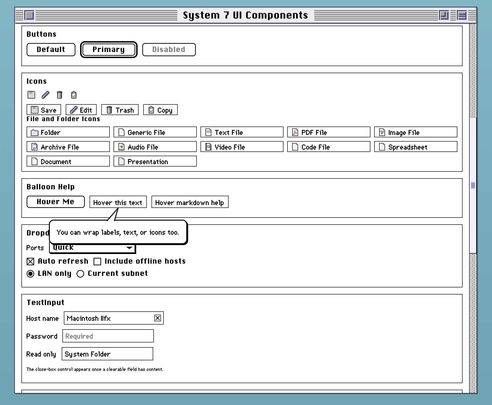

# @lkmc/system7-ui

> [!IMPORTANT]
> LLM disclosure: This codebase was written with substantial help from large language models: AI coding agents working from the [`AGENTS.md`](AGENTS.md) brief in this repo.

Reusable System 7 visual components for Svelte/Tauri apps.

**Latest release:** [GitHub Release](https://github.com/L-K-M/system7-ui/releases/latest)



> [!IMPORTANT]
> LLM Disclosure: This package was developed with the assistance of large language models (AI coding tools).

## Install

```bash
npm install @lkmc/system7-ui
```

For local development before publishing:

```json
{
  "dependencies": {
    "@lkmc/system7-ui": "file:../../system7-ui"
  }
}
```

## Usage

Import the shared stylesheet once in your root layout:

```ts
import '@lkmc/system7-ui/styles.css';
```

Wrap the section that uses these components with `.s7-root` to apply System 7 typography and scrollbar styling without leaking into the entire host app:

```svelte
<div class="s7-root">
  <!-- system7-ui components -->
</div>
```

### Color Tokens

`system7-ui` exposes CSS variables for theming. Core color tokens:

- `--system7-color-accent`
- `--system7-color-accent-text`
- `--system7-color-highlight`
- `--system7-color-highlight-text`
- `--system7-color-ink`
- `--system7-color-paper`

Default accent/highlight tokens automatically fall back to legacy names used in host apps:

- `--system-accent-color`
- `--system-accent-text-color`
- `--system-highlight-color`
- `--system-highlight-text-color`

### Typography and Layout Tokens

Override these on `:root`, or on `.s7-root` or any element inside it to change only that subtree:

- `--system7-font-size` (default `24px`): Geneva text inside `.s7-root`.
- `--system7-control-font-size` (default `18px`): Sysfont text in buttons, checkbox and radio labels, dropdowns, `.dialog-text` and headings.
- `--system7-safe-area-top`, `--system7-safe-area-right`, `--system7-safe-area-bottom`, `--system7-safe-area-left` (default `env(safe-area-inset-*, 0px)`): insets that keep content clear of the notch, status bar and gesture bar. See [Mobile and touch](#mobile-and-touch).
- `--system7-scrollbar-size` (default `16px`): width of vertical and height of horizontal scrollbars. Set it on the scrolling element or an ancestor.
- `--system7-table-cell-padding` (default `5px 8px`): `DataTable` cell padding. Use `12px 8px` for taller touch rows.
- `--system7-notification-offset-bottom` and `--system7-notification-offset-right` (default `20px`): distance of the `Notification` stack from the bottom and right edges, added to the safe-area insets. The right offset also sets the minimum left margin.

The bundled Geneva font is drawn on a 16px pixel grid: `16px` renders at 1x, `24px` at 1.5x and `32px` at 2x. Other sizes scale its pixels unevenly, and Geneva below `16px` is hard to read on phones. On phones, use `24px` for primary text and `16px` for secondary text.

`.s7-root *` sets every element's font size from the token, so a plain `font-size` on a container does not reach its children. Set the token instead, and use `px`: an `em` or `%` value is resolved again on every nested element and compounds.

```css
.entry-meta {
  --system7-font-size: 16px;
}
```

`.s7-root` also sets `-webkit-tap-highlight-color: transparent`, so mobile browsers do not flash a translucent box over tapped elements. Components draw their own pressed states.

### macOS/Tauri System Colors

If your app already retrieves OS colors (for example, through a Tauri command), you can apply them directly with exported helpers:

```ts
import { applySystem7SystemColors } from '@lkmc/system7-ui';

const colors = await TauriService.getSystemColors();
applySystem7SystemColors(colors);
```

Or generate an inline style string for a specific container:

```ts
import { getSystem7ColorStyle } from '@lkmc/system7-ui';

const style = getSystem7ColorStyle(colors);
```

Import components from the package root:

```svelte
<script lang="ts">
  import { Button, TitleBar } from '@lkmc/system7-ui';
</script>
```

## Mobile and touch

Touch support needs no extra props. To lay out a full-screen app on a phone:

1. Add `viewport-fit=cover` to the viewport meta tag. The page can then draw under the notch, status bar and gesture bar, and `env(safe-area-inset-*)` reports their size:

   ```html
   <meta name="viewport" content="width=device-width, initial-scale=1, viewport-fit=cover" />
   ```

2. Pad your own fixed or full-height layout with the `--system7-safe-area-*` tokens. `ModalDialog`, `MovableDialog` and `Notification` already stay inside them. If your WebView reports the insets incorrectly, set the tokens yourself, for example from values reported by native code.

   ```css
   .app-shell {
     padding-top: var(--system7-safe-area-top);
     padding-bottom: var(--system7-safe-area-bottom);
   }
   ```

3. Size text on the Geneva pixel grid, as described in [Typography and Layout Tokens](#typography-and-layout-tokens).

On touch devices, the components also:

- Give small controls an invisible hit area of at least 44px on coarse pointers (`@media (pointer: coarse)`) without changing how they look or lay out: `Checkbox`, `Radio`, `icon` buttons, the `TextInput` clear box, the `Notification` dismiss box and the `TitleBar` boxes. Hit areas of controls closer than 44px apart overlap and the later control in the DOM wins, so space touch rows at least 44px apart.
- Widen a clearable `TextInput`'s right padding to 44px while its clear box shows on a coarse pointer, so a tap near the end of the text places the caret instead of clearing the field.
- Dim `icon` buttons on hover only under `@media (hover: hover)`, so a tap does not leave one dimmed.
- Keep `BalloonHelp` closed on touch taps. Mouse and pen hover and keyboard focus still open it.
- Set `touch-action: none` on a draggable `TitleBar`, so a drag moves the window instead of scrolling the page.
- Limit `ModalDialog` and `MovableDialog` to the safe area and scroll their content when it does not fit. A dragged `MovableDialog` stays inside the safe area, also after the window is resized.

## Exports

- `BalloonHelp`
- `ArchiveFileIcon`
- `AudioFileIcon`
- `Button`
- `Checkbox`
- `CloseIcon`
- `CodeFileIcon`
- `ConfirmDialog`
- `CopyIcon`
- `DataTable`
- `DocumentFileIcon`
- `DownloadIcon`
- `Dropdown`
- `EditIcon`
- `ErrorBoundary`
- `ErrorBanner`
- `ExpandableSection`
- `FolderIcon`
- `GenericFileIcon`
- `ImageFileIcon`
- `ModalDialog`
- `MovableDialog`
- `Notification`
- `PdfFileIcon`
- `PresentationFileIcon`
- `ProgressBar`
- `Radio`
- `SpreadsheetFileIcon`
- `SystemErrorDialog`
- `TextFileIcon`
- `TextInput`
- `TitleBar`
- `TrashIcon`
- `VideoFileIcon`

### Utility Exports

- `applySystem7SystemColors`
- `createNotificationStore`
- `getSystem7ColorStyle`
- `getSystem7ColorVariables`
- `getSystem7WindowStyle`
- `getSystem7WindowToneVariables`

### Type Exports

Each component now includes an explicit `*Props` type export from the package entrypoint.

```ts
import type {
  ButtonProps,
  CheckboxProps,
  ModalDialogProps,
  MovableDialogProps,
  PdfFileIconProps,
  System7SystemColors
} from '@lkmc/system7-ui';
```

### File Icons

Use the file icon components for file pickers, upload queues, and table rows:

- `FolderIcon`
- `GenericFileIcon`
- `TextFileIcon`
- `PdfFileIcon`
- `ImageFileIcon`
- `ArchiveFileIcon`
- `AudioFileIcon`
- `VideoFileIcon`
- `CodeFileIcon`
- `SpreadsheetFileIcon`
- `DocumentFileIcon`
- `PresentationFileIcon`

```svelte
<script lang="ts">
  import { FolderIcon, PdfFileIcon, TextFileIcon } from '@lkmc/system7-ui';
</script>

<FolderIcon alt="Books" />
<PdfFileIcon />
<TextFileIcon />
```

## BalloonHelp

`BalloonHelp` wraps any element and shows hover help text.

```svelte
<script lang="ts">
  import { BalloonHelp, Button } from '@lkmc/system7-ui';

  const helpMessage = [
    '**Scan profile tips**',
    '',
    '- Quick: common ports',
    '- Deep: larger scan range',
    '- Use `Auto refresh` for live updates'
  ].join('\n');
</script>

<BalloonHelp markdown message={helpMessage} position="bottom" delay={600}>
  <Button>Hover for help</Button>
</BalloonHelp>
```

Props:

- `message` (`string`): Balloon text content.
- `position` (`'top' | 'bottom'`, default `bottom`): Preferred side of the anchor element.
- `delay` (`number`, default `1000`): Hover delay in milliseconds before showing.
- `markdown` (`boolean`, default `false`): Renders `message` as Markdown (raw HTML input is disabled).

Behavior notes:

- Automatically repositions to stay within the viewport bounds.
- Constrains width/height and wraps long text to avoid screen overflow.
- Opens on mouse or pen hover and on keyboard focus, but not on touch taps, which have no hover to close it again.

## Button

`Button` supports three variants and a default slot for label/icon content.

Props:

- `variant` (`'default' | 'primary' | 'icon'`, default `default`)
- `disabled` (`boolean`, default `false`)
- `type` (`'button' | 'submit' | 'reset'`, default `button`)
- `title` (`string`, default `''`)
- `onclick` (`(e: MouseEvent) => void`)

Other attributes, such as `aria-label`, `data-*`, `name`, `value`, `form` and event handlers like `onfocus`, go to the native `<button>`. A `class` attribute is ignored so the component keeps its own styling hooks.

```svelte
<Button variant="icon" aria-label="Copy entry" data-entry-id={entry.id} onclick={copy}>
  <CopyIcon />
</Button>
```

Slots:

- `default`: button content (text or icon)

## Checkbox

`Checkbox` supports either a `label` prop fallback or slotted label content.

Props:

- `checked` (`boolean`, default `false`)
- `disabled` (`boolean`, default `false`)
- `id` (`string`, default `''`)
- `name` (`string`, default `''`)
- `value` (`string`, default `'on'`)
- `label` (`string`, default `''`)
- `onchange` (`(checked: boolean, e: Event) => void`)

Slots:

- `default`: label content shown to the right of the checkbox icon

## DataTable

`DataTable` provides a reusable split-header table shell with sortable headers, dual header/body separators, empty/loading states, and a row slot.

Common props:

- `columns` (`Array<{ key, label, width?, className?, align?, sortable?, ariaLabel? }>`)
- `sortKey` (`string | null`)
- `sortDirection` (`'asc' | 'desc'`)
- `onSort` (`(key: string) => void`)
- `loading` (`boolean`)
- `loadingText` (`string`)
- `empty` (`boolean`)
- `emptyText` (`string`)
- `emptyColspan` (`number | null`)
- `showHeader` (`boolean`, default `true`): set `false` to drop the header row and the double rule under it, for example in a phone list. `columns` still sets the column widths. Without a header, screen readers get no column names, so make each cell understandable on its own.

Slots:

- `default`: table row markup (`<tr>...</tr>`) for the body
- `header` (optional): custom `<tr>...</tr>` header when you need advanced layouts. Not rendered when `showHeader` is `false`.

## Radio

`Radio` supports either a `label` prop fallback or slotted label content.

Props:

- `checked` (`boolean`, default `false`)
- `disabled` (`boolean`, default `false`)
- `id` (`string`, default `''`)
- `name` (`string`, default `''`)
- `value` (`string`, default `''`)
- `label` (`string`, default `''`)
- `onchange` (`(value: string, e: Event) => void`)

Slots:

- `default`: label content shown to the right of the radio icon

## TextInput

`TextInput` is a System 7 styled single-line text field.

Props:

- `value` (`string`, default `''`): current value, supports `bind:value`
- `type` (`'text' | 'password' | 'email' | 'search' | 'url' | 'tel'`, default `text`)
- `disabled` (`boolean`, default `false`)
- `readonly` (`boolean`, default `false`)
- `id`, `name`, `placeholder`, `title` (`string`, default `''`)
- `ariaLabel` (`string`, default `''`): accessible label when no visible `<label>` is used
- `clearable` (`boolean`, default `false`): shows a close-box style clear control while the field has content
- `oninput` (`(value: string, e: Event) => void`): fired on every keystroke
- `onchange` (`(value: string, e: Event) => void`): fired when the value is committed
- `onkeydown` (`(e: KeyboardEvent) => void`): keydown handler, for example for Enter or Escape
- `onclear` (`() => void`): fired after the clear control empties the field

Other attributes, such as `inputmode`, `enterkeyhint`, `autocapitalize`, `autocomplete`, `spellcheck`, `minlength`, `aria-*`, `data-*` and event handlers like `onfocus`, go to the native `<input>`. A `class` attribute is ignored so the component keeps its own styling hooks, and a non-empty `ariaLabel` prop wins over an `aria-label` attribute.

Methods (use `bind:this`):

- `focus(options?: FocusOptions)`: focuses the input, for example to open the soft keyboard
- `select()`: selects the whole text

```svelte
<script lang="ts">
  import { TextInput } from '@lkmc/system7-ui';

  let search: TextInput;
</script>

<TextInput
  bind:this={search}
  ariaLabel="Search"
  inputmode="search"
  enterkeyhint="search"
  autocapitalize="off"
/>
<button type="button" onclick={() => search.focus({ preventScroll: true })}>Search</button>
```

## TitleBar

`TitleBar` draws the striped System 7 window title bar with optional close, zoom and shade boxes.

Props:

- `title` (`string`, required)
- `closable`, `collapsible`, `shadeable` (`boolean`, default `false`): show the close, zoom (resize-to-fit) and shade boxes
- `draggable` (`boolean`, default `false`): calls `ondragstart` on mouse or touch down on the bar
- `focused` (`boolean`, default `true`): draws the inactive bar, without stripes or boxes, when `false`
- `onclose`, `oncollapse`, `onshade` (`() => void`): fired when the matching box is activated
- `ondragstart` (`(e: MouseEvent | TouchEvent) => void`)
- `closeLabel` (`string`, default `'Close'`), `collapseLabel` (`string`, default `'Zoom'`), `shadeLabel` (`string`, default `'Collapse'`): accessible names of the boxes. The shade box toggles, so pass `'Expand'` as `shadeLabel` while the window is shaded.

Slots:

- `actions` (optional): controls at the right end of the bar, before the zoom and shade boxes. Pressing them never starts a drag. Keep the content at most 34px tall. In a runes-mode parent, `{#snippet actions()}` fills the slot too.

Long titles are shortened with an ellipsis to stay clear of the boxes and actions, and the bar keeps its 35px height in a flex column.

```svelte
<TitleBar title="Settings" closable onclose={close}>
  <svelte:fragment slot="actions">
    <Button onclick={save}>Done</Button>
  </svelte:fragment>
</TitleBar>
```

## ConfirmDialog

`ConfirmDialog` shows a modal message with confirm and cancel buttons.

Props:

- `message` (`string`, default `''`)
- `okText` (`string`, default `'OK'`)
- `cancelText` (`string`, default `'Cancel'`)
- `width` (`string`, default `'400px'`): CSS width of the dialog content inside its frame. The dialog still shrinks to fit a narrower screen.
- `onconfirm` (`() => void`): fired by the OK button or Enter
- `oncancel` (`() => void`): fired by the cancel button, the backdrop or Escape

## SystemErrorDialog

`SystemErrorDialog` renders the classic System 7 bomb alert ("Sorry, a system error occurred.") — ideal as a themed fatal-error screen or an `ErrorBoundary` fallback.

Props:

- `message` (`string`, default `'Sorry, a system error occurred.'`)
- `detail` (`string`, default `''`): optional secondary line (e.g. `unimplemented trap`)
- `restartText` (`string`, default `'Restart'`)
- `onrestart` (`() => void`): fired when the restart button is clicked

## ErrorBoundary

`ErrorBoundary` catches child rendering errors and displays a retry fallback.

Props:

- `fallbackMessage` (`string`, default `'Something went wrong while rendering this view.'`)
- `onerror` (`(error: unknown) => void`)

Slots:

- `default`: protected content block

## ExpandableSection

`ExpandableSection` provides a System 7-style disclosure row with an SVG triangle and collapsible content.

Props:

- `label` (`string`, default `''`)
- `expanded` (`boolean`, default `false`)
- `disabled` (`boolean`, default `false`)
- `onchange` (`(expanded: boolean) => void`)

Slots:

- `default`: content shown when expanded

## Demo project

A local demo app is included in `demo/` to preview all components.

```bash
npm run demo:install
npm run demo:dev
```

Build the demo:

```bash
npm run demo:build
```

Reference documentation is also available in `docs/COMPONENTS.md`.

## Quality checks

Run the core validation commands locally:

```bash
npm run check
npm run lint
npm run format:check
npm run test
```

Or run them in one line:

```bash
npm run check && npm run lint && npm run format:check && npm run test
```

### Pre-commit checks (including IntelliJ)

This repo uses Husky pre-commit hooks. After `npm install`, commits run:

- staged-file autofix via `lint-staged`
- `npm run check`
- `npm run lint`
- `npm run format:check`
- `npm run test`

If you commit from IntelliJ, make sure the commit dialog has **Run Git hooks** enabled so the same pre-commit checks run there too.

## Storybook

Storybook is included for interactive component documentation, controls, and accessibility checks.

Start Storybook in development mode:

```bash
npm run storybook
```

Open `http://localhost:6006` to browse stories.

Build static Storybook docs:

```bash
npm run storybook:build
```

Storybook notes:

- Stories live in `stories/*.stories.ts`.
- Fixture wrappers for dialog/slot-heavy components live in `stories/fixtures/`.
- Global System 7 styling is applied through `.storybook/preview.ts` and `.storybook/StoryRoot.svelte`.
- The a11y addon is enabled so you can run accessibility checks per story from the Storybook UI.

To preview the generated static docs locally after build:

```bash
npx serve storybook-static
```

## License note

The Unlicense in this repository applies to the code authored in this package.

Bundled fonts in `src/assets/fonts` are third-party assets and are not re-licensed by this repository. They keep their original licenses and terms.

## Packaging and publish

```bash
npm install
npm run package
npm login --scope=@lkmc --registry=https://registry.npmjs.org/
npm publish --access public
```

Or use the helper script:

```bash
npm run publish:npm
```

With 2FA OTP:

```bash
npm run publish:npm -- --otp 123456
```

If your npm account enforces 2FA for publish, include an OTP:

```bash
npm publish --access public --otp=123456
```

Or use a granular access token with publish permission and 2FA bypass enabled.

## Publishing updates

For each new release:

```bash
# choose one
npm version patch
# npm version minor
# npm version major

npm run publish:npm
# or, with 2FA
# npm run publish:npm -- --otp 123456
```

The publish script runs `npm run check` and `npm run package` before publishing.

Optional flags:

```bash
# only if you already ran checks/package yourself
npm run publish:npm -- --skip-check --skip-package
```

This creates a git commit + tag for the version bump. Push both after publishing:

```bash
git push
git push --tags
```

Then update consuming apps to the new package version:

```bash
npm install @lkmc/system7-ui@^<new-version>
```

For a local package archive (without publishing):

```bash
npm pack
```

This creates `lkmc-system7-ui-<version>.tgz` that consumers can install.
